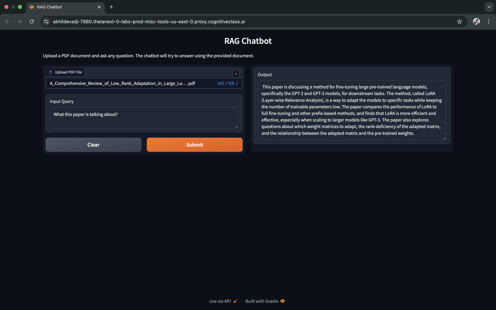
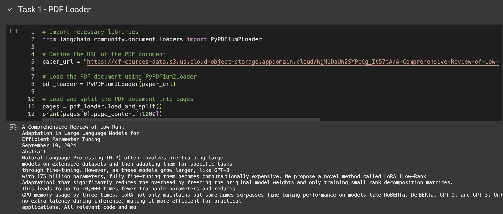
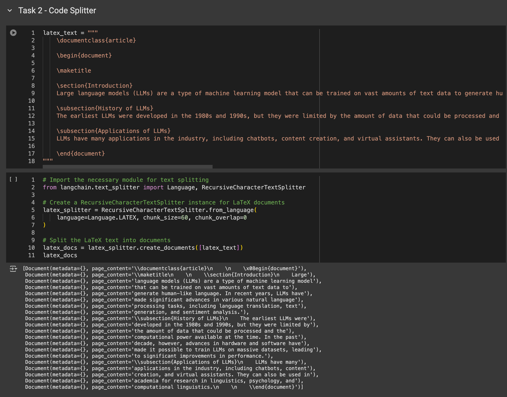
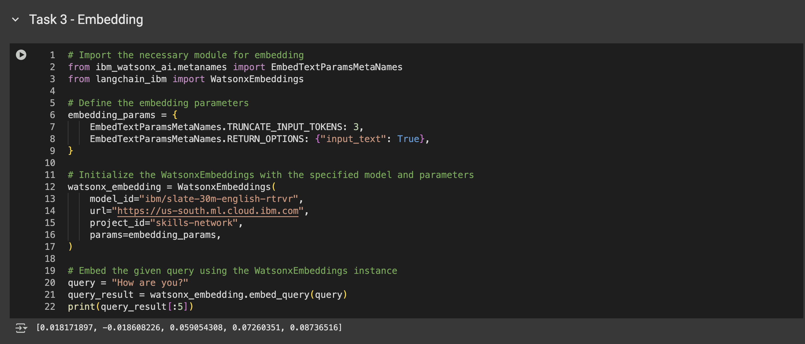
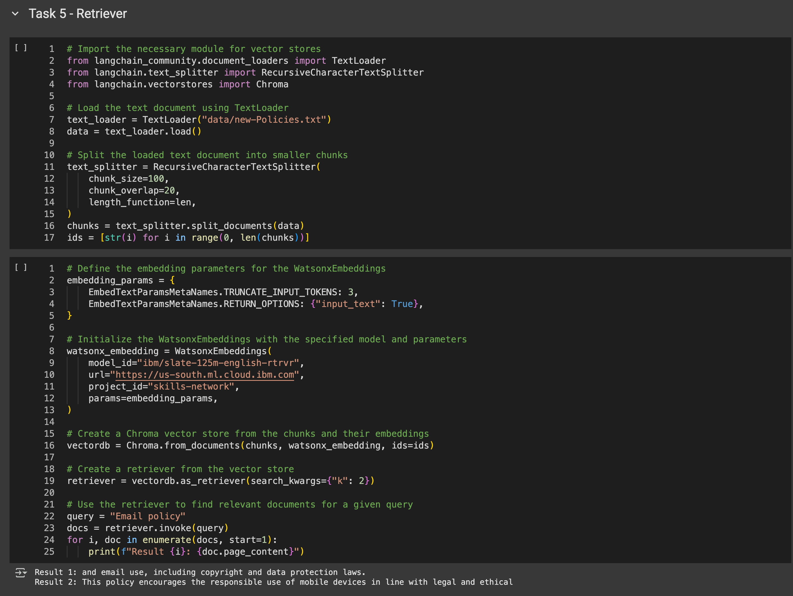
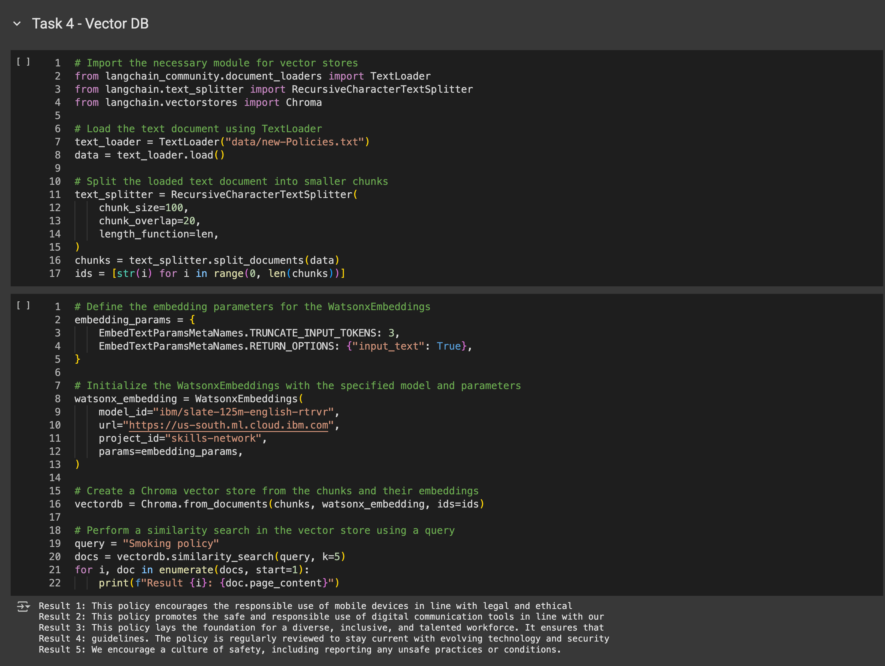

# IBM Generative AI Engineering Capstone Project – QA Chatbot

Welcome to the repository for my **IBM Generative AI Capstone Project**. This project demonstrates the application of Retrieval-Augmented Generation (RAG) pipelines using IBM Watsonx, LangChain, and ChromaDB to build a chatbot capable of answering questions from user-uploaded PDF documents.

---

## 🏆 Certification Summary

This capstone project marks the culmination of the **IBM Generative AI Engineering Professional Certificate**. The course emphasizes:

- Building real-world Gen AI applications
- Integrating foundation models with LangChain
- Working with embeddings and vector stores
- Deploying lightweight AI apps using Gradio

🔗 [View Course on Coursera](https://www.coursera.org/professional-certificates/ibm-generative-ai-engineering)

---

## 🧪 Project Overview

In this project, I built a **Gradio-based QA chatbot** that uses the IBM Watsonx LLM and embedding models to answer questions about PDF content uploaded by the user.

### ✅ Key Features:

- Upload a PDF and ask questions about its content
- Uses **LangChain's RAG pipeline** with **Watsonx** models
- Embeddings stored in **ChromaDB**
- **Gradio interface** for easy interaction
- Automatic chunking and processing of document text

---

## 📂 Repository Contents

| File / Folder                              | Description                                                              |
|-------------------------------------------|--------------------------------------------------------------------------|
| 📁 `src/qa_chat_bot/`                      | Core logic and app code for the chatbot                                  |
| ├── `app.py`                              | Main script to run the QA chatbot                                        |
| ├── `__init__.py`                         | Package initializer                                                      |
| 📁 `certificates/`                         | Contains the course completion certificate                               |
| └── `IBM Generative AI Capstone Project.jpg` | Certification proof                                                  |
| 📁 `screenshots/`                          | Visuals from different development stages                                |
| 📁 `docs/`                                 | Optional documentation and notes                                         |
| 📁 `data/`                                 | Sample PDFs for testing                                                  |
| 📁 `notebooks/`                            | Jupyter notebooks used during development                                |
| 📄 `.env`                                  | Environment variables with IBM credentials                               |
| 📄 `README.md`                             | This file                                                                |
| 📄 `pyproject.toml`                        | Poetry dependency and package manager file                               |
| 📄 `poetry.lock`                           | Locked versions of all dependencies                                      |

---

## 🖼️ Project Structure

Here’s the folder structure used in this project:

---

## 💡 How It Works

When a user uploads a PDF file and submits a query:

1. The **PDF** is loaded using `PyPDFLoader`.
2. Text is split into chunks using `RecursiveCharacterTextSplitter`.
3. Embeddings are generated via **WatsonxEmbeddings**.
4. These are stored in a **Chroma** vector database.
5. **RetrievalQA** from LangChain is used to fetch relevant chunks.
6. The **Watsonx LLM** responds with a generated answer based on context.

---

## 🚀 Skills Demonstrated

- Working with IBM Watsonx APIs for LLMs and embeddings
- Implementing RAG pipelines with LangChain
- Processing and chunking PDFs for semantic search
- Setting up and using a local vector database (Chroma)
- Creating an interactive web app with Gradio
- Managing environments with Poetry

---

## 🧠 Screenshots

A visual walkthrough of the project’s development:

- 
- 
- 
- 
- 
- 

---

## 📦 Technologies Used

- **Python**
- **LangChain**
- **IBM Watsonx LLM & Embeddings**
- **ChromaDB**
- **Gradio**
- **PyPDF**
- **Poetry**

---

## 🎯 Outcome

This project integrates advanced Gen AI techniques into a functional QA chatbot. It showcases my ability to apply LLMs, vector databases, and modern AI pipelines to build practical, scalable AI applications using Python.

---

Thank you for visiting!